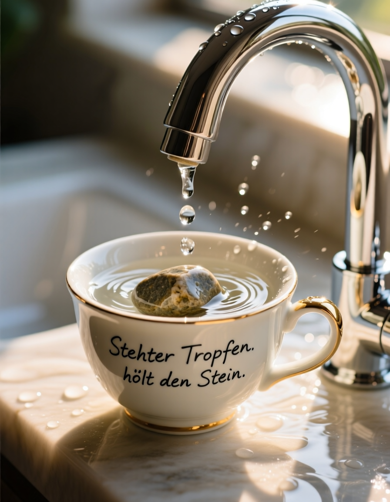

# Prompt-Design Schulungsunterlage – Qwen-Image fp8

In dieser Unterlage werden die Promptgestaltung und semantische Ausformungen für das Model Qwen-image 
veranschaulicht. Qwen-image hat eine extrem große Bandbreite, um Generationsvorgaben und die Gewichtung
einzelner Promptbestandteile umzusetzen. Hier werden regelmäßig neue Versuche, Experimente und auch 
"Out-of-Prompt" Ereignisse vorgestellt. Die Lizenz erlaubt das Kopieren und Verwenden der Prompts, so wie der 
Outputs für kommerzielle und persönliche Zwecke.

## Modellinformationen
- **Modellname:** qwen_image_edit_fp8_e4m3fn_Audit_v1_signed.safetensors  
- **Lizenz:** Apache 2.0  
- **Besonderheiten:** Hochqualitative Bildgenerierung mit Text-Rendering, optimiert für fotorealistische Szenen.
- **Engine:** ComfyUI/ version: 0.3.51/ frontend version: 1.25.9
- **Low Rank model:** None/keine 

---

# 1. Allgemeines Prompting (qwen-image)

## Prompt 1 – Edle Tasse
**Ziel:** Fotorealistische Produktfotografie – Wassertropfen, Tasse, Stein, Inschrift.

**Beispielbild:**  

**Positiver Prompt**

Ultra-detailed macro shot of a luxurious ceramic cup in sharp focus, positioned under a sleek modern faucet. 
Water droplets gently falling into the cup, soft ripples forming, high-speed capture of droplet impact. 
A natural river stone rests inside the cup, its surface showing tiny, freshly carved indentations where droplets strike, 
subtle micro erosion visible. Warm morning sunlight beams softly illuminate the scene, highlighting fine textures of ceramic glaze, 
droplets and stone. On the cup, an elegant handwritten inscription reads: "Stehter Tropfen hölt den Stein". Atmosphere calm, refined, 
realistic, ultra photorealism, 8k render quality, cinematic composition, shallow depth of field, soft bokeh, hyperreal lighting.

**Negativer Prompt**

cartoon, anime, CGI artifacts, low detail, low resolution, oversaturated colors, text distortion, misspelled lettering, 
extra objects, deformed hands, unrealistic water, blurry textures

---

## Prompt 2 – Singvogel mit Wecker
**Ziel:** Wildlife-Fotografie – Singvogel zieht Regenwurm, Wecker im Hintergrund.

**Beispielbild:**  

**Positiver Prompt**

Ultra-realistic wildlife photograph, premium quality, captured at sunrise on a lush spring meadow, cinematic golden light. 
Foreground in sharp focus: a small songbird, natural feather detail, eyes bright, mid-action pulling a wriggling earthworm from dew-covered grass. 
Droplets shimmer on grass blades and half-closed flowers, crisp macro textures. Background softly blurred (bokeh): a vintage alarm clock (Bimmelwecker), 
slightly out of focus but still readable, classic brass finish, showing time 6:05 with clear hour and minute hands. 
No digital elements, purely analog design. Depth of field emphasizes bird and worm, clock gently softened to enhance realism. 
Photography style: high-end wildlife magazine, 8k resolution, HDR lighting, shallow depth of field, cinematic color grading, 
realistic lens reflections, professional telephoto wildlife lens rendering.

**Negativer Prompt**

cartoon, anime, CGI, distorted clock face, melted shapes, missing hands, unrealistic bird anatomy, 
plastic textures, oversaturated colors, text artifacts, grainy image

---

## Prompt 3 – Person am Bahnsteig mit AI-Act-Schild
**Ziel:** Editorial Photography – Professionelle Personendarstellung + Text im Rahmen.

**Beispielbild:**  

**Positiver Prompt**

Ultra-realistic documentary-style photograph, premium editorial quality, captured with Canon EOS R5, RF 50mm f/1.2L lens, aperture f/2.8, ISO 200, shutter 1/500s, natural light.

promptA 30-year-old woman stands on an older subway station platform, train not yet arrived. She looks confidently yet slightly carefree toward the viewer, long black hair with natural highlights, dark brown eyes, extra beautiful eyes, realistic skin texture, soft cinematic lighting. Outfit: bootcut blue jeans with colorful belt buckle, white collared shirt with sleeves rolled up. She holds a picture frame-style sign (85%), perfectly straight, centered in frame, OR slightly tilted for natural handheld effect (15%). Inside frame: sharp, clean sans-serif text, perfectly legible: "Bist Du bereit für EU AI-Act?".

Background softly blurred (bokeh), other passengers in light motion blur, HDR rendering, 8k resolution, high-end magazine photo aesthetic, natural color grading, realistic lens effects.

**Negativer Prompt**

cartoon, anime, CGI, plastic skin, bad anatomy, distorted hands, unreadable text, misspelled words, blurry sign, overexposed light, low detail, unrealistic proportions

---

## Grundlegende Prinzipien für SD-Prompting
1. **Klarheit & Detailtiefe** – präzise Beschreibung der Szene, Materialien, Lichtquellen.  
2. **Fokushierarchie** – Vordergrund scharf, Hintergrund weich beschrieben.  
3. **Stildefinition** – Dokumentarisch, Magazin-Stil, Produktfotografie etc.  
4. **Negativ-Prompt** – gezielt Artefakte, CGI-Look und fehlerhafte Textdarstellung ausschließen.  

---

# 2. Entwicklung syntaktischer Anweisungen (qwen-image)

## Prompt Evolution Qwen-Image 

Qwen-image ist in vielerlei Hinsicht anders zu behandeln, als Modelle mit Textencodern, welche sich über Monate und Jahre schon etabliert haben.
Zum Beispiel ist das Textverständnis in "gängigen" Prompts ein diskret anderes. Wir behandeln die Beispiele als Grundlage für die 
Interpretation der Generationsanweisung. Z.B:

**Qwen-Image interpretiert „shot with…“ (camera) oder Kameraspezifikationen als physische Objekte oder Schrift im Bild. Ebenso wird die Standard-Personendarstellung oft asiatisch.**

Erstmal kein Problem. Im Falle einer gezielten Generation, welche einer Deadline im gewissen Sinne unterliegt, allerdings schon. Sehen wir uns die Evolution der Generationsanweisung einmal 
genauer an. 

Gewünscht ist ein Output mit folgender Anweisung:

**Prompt**: High-end editorial photograph, documentary style, 8k resolution, HDR,  
a young businesswoman (30), natural look, slight smile, confident posture,  
standing in a modern loft kitchen with morning sunlight streaming through large windows,  
soft shadows, light dust particles in air, authentic and candid moment,  
wearing a tailored blazer, white blouse, minimal jewelry, casual yet professional style,  
shot with Leica SL2 + Summilux 50mm f/1.4, cinematic depth of field,  
magazine-ready composition, premium lifestyle photography.

Dies ist bei 55 Steps und einem Seed von 795799441902684, das Produkt:

Deutlich zu sehen, das im Spülbecken etwas wegspritzt. Nun, das ist wohl dem "shot..." zu verdanken.
Der Herd in der rechten Bildhälfte hat das Logo von Leica repräsentativ eingebettet. 
Da hat Qwen also, in ihrer Funktion als texttrainiertes Modell, etwas falsch interpretiert. Oder es lag an
der Art der Promptausformung.

Starten wir also den nächsten Versuch. Diesmal lautet die Anweisung:

**Prompt**: High-end editorial photograph, ultra-realistic, 8k, HDR,  
Caucasian woman, 30 years old, fair skin, long blonde hair, natural makeup, slight smile, confident yet casual pose,  
standing in a modern loft kitchen, warm morning sunlight entering through large windows, soft shadows and natural contrast,  
authentic lifestyle scene, elegant wardrobe: tailored blazer, white blouse, subtle jewelry,  
premium magazine aesthetic, professional photography look, cinematic depth of field, realistic colors, no text, no logos.

Dies ist wieder bei 55 Steps und einem Seed von 795799441902684, das Produkt:

Schon etwas gezielter und semantisch präziser umgesetzt. Nur wer hat in seiner Küche zwei separate Spülbecken?
Und die Person ist auch etwas zu sehr "gefiltert". Das geht bedeutend besser.

Sehen wir uns die finale Anweisung an. Nun haben wir die Küche ausgetauscht gegen eine moderne und junge Agentur.
Aber immer noch im Kontext, des ursprünglichen Promptes.

**Prompt**: Ultra-realistic editorial photograph, cinematic and premium look,  
inside a creative agency loft, open-space design, glass walls, warm light bouncing off modern furniture,  
a young professional woman, 30, Caucasian, fair skin, long blonde hair, natural makeup,  
sitting on a sleek office stool, hands resting lightly near a slim laptop on a wooden desk,  
she glances toward the camera with a thoughtful yet approachable expression,  
clothing: stylish but understated, tailored pants, soft blouse, no logos,  
depth of field draws focus to subject, background softly blurred with hints of creative workspace,  
magazine-style composition, elegant light diffusion, high realism, no text, no watermark.

Dies ist wieder bei 55 Steps und einem Seed von 795799441902684, das Produkt:

Hier stimmt die Umsetzung zu 98%. Das kann so in die Nachbearbeitung und für den Export vorbereitet werden.

Generierte Outputs sind und bleiben immer RAW-Dateien, welche im professionellen Einsatz eine Nachbearbeitung
(Entwicklung) benötigen. Denn ein Output kann technisch betrachtet immer nur eine Wahrscheinlichkeit an der Wahrheit sein.
Egal wie gut oder hochwertig ein Output zunächst wirken mag. 

Mehr Informationen zu diesem Aspekt:

[Warum Stable Diffusion nicht "perfect on demand" sein kann🛡️](https://modula-r.com/generierung)

---

## Hinweis zur Nutzung
Diese Prompts wurden für das Modell **Qwen-Image fp8** erstellt.  
Lizenz: [Apache 2.0](https://www.apache.org/licenses/LICENSE-2.0)  

Prompts und Bilder unterliegen der Apache2.0 Lizenz und sind innerhalb dieser Lizenz verwendbar.
